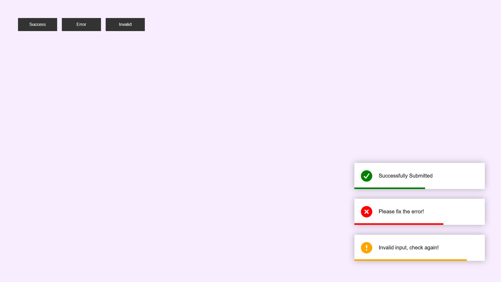

# 🔔 Toast Notification

A responsive Toast Notification App built using HTML, CSS, and JavaScript that displays animated success, error, and invalid alerts with icons and auto-dismiss functionality.

---

## 🚀 Features

- Success notification
- Error notification
- Invalid notification
- Animated slide-in effect
- Auto-dismiss after 5 seconds
- Progress bar animation
- Font Awesome icons
- Responsive design
- Clean and user-friendly interface

---

## 🛠️ Technologies Used

- HTML5
- CSS3
- JavaScript
- DOM Manipulation
- CSS Animations
- Font Awesome

---

## 📸 Project Preview



---

## 📂 Project Structure

```text
Toast Notification/
│
├── index.html
├── style.css
├── script.js
├── README.md
│
└── Images/
    └── toast-notification-demo.png
```

---

## 💡 What I Learned From This Project

While building this project, I learned:

- DOM Manipulation
- Dynamic Element Creation
- Event Handling
- createElement()
- appendChild()
- innerHTML
- classList.add()
- setTimeout()
- CSS Animations
- Progress Bar Animation
- Pseudo Elements
- SVG Styling
- Responsive Design Basics

---

## 🎯 Future Improvements

- Dark Mode
- Custom Notification Messages
- Close Button for Notifications
- Different Notification Positions
- Sound Effects
- Notification Queue System

---

## 👨‍💻 Author

**Mohammed Naeem Patel**

GitHub:
https://github.com/Mohammed-Naeem-Patel

---

## ⭐ Note

This project was created for practice and learning JavaScript concepts through a real-world Toast Notification Application.

It helped me strengthen my understanding of DOM Manipulation, Dynamic Element Creation, Event Handling, CSS Animations, and User Interface Design.
